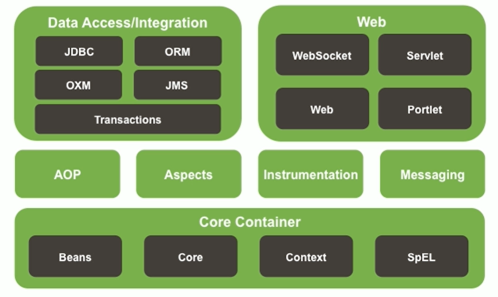

# Spring

Spring 是一个为简化企业级应用开发而生的开源框架，可以使用简单的 JavaBean 实现以前只有 EJB 才能实现的功能

Spring 是 JavaSE/JavaEE 的一站式框架

**优点**

- 方便解耦，简化开发：Spring 是一个大工厂，可以将所有对象的创建和依赖关系的维护，交给 Spring 管理
- 支持 AOP 编程：Spring 提供面向切面编程，可以方便的实现对程序的权限拦截、运行监控等功能
- 支持声明式事务：只需要通过配置就可以完成对事务的管理，而无需手动编程
- 方便测试：支持 JUnit4, 可以通过注解方便的测试 Spring 程序
- 集成各种优秀框架：直接支持 Struts/Hibernate/MyBatis 等框架
- 降低 JavaEE API 的使用难度：Spring 对 JavaEE 中非常难用的一些 API(JDBC/JavaMail/RMI) 提供了封装，大大降低其使用难度

**Spring 模块**



**IOC 原理**


<!-- Spring jar dependencies -->

## IoC & DI

控制反转 (Inverse of Control,IoC): 对象依赖的控制权反转了，从程序转到IoC容器

依赖注入 (Dependency Injection,DI): IoC 的实现方式 -- 在创建对象时注入对象的依赖

[IoC & DI](https://www.iteye.com/blog/jinnianshilongnian-1413846)

Martin Fowler's [Inversion of Control Containers and the Dependency Injection pattern](https://martinfowler.com/articles/injection.html)

[Spring Document](https://docs.spring.io/spring/docs/4.2.4.RELEASE/spring-framework-reference/html/)

## Spring Bean 的管理

### Bean 的常用配置

```bash
# Bean 的别名
id: 指定 Bean 的别名，在 IoC 容器中必须是唯一的
name: 指定 Bean 的别名，在 IoC 容器中不强制要求是唯一的，但使用时通常应该保证其唯一性。
id & name: name 可以包含特殊字符，id 不可以

# Bean 的类名
class: 指定 Bean 的完整类名，用于 IoC 容器反射生成类的实例

# Bean 的作用域
scope: 指定 Bean 的作用域
    singleton: 默认值，IoC 容器中仅存在一个 Bean 实例
    prototype: 每次调用 getBean() 都将创建一个新的 Bean 实例
    request: 每一个 HTTP 请求都将创建一个新的 Bean 实例
    session: 每一个 HTTP 会话都将创建一个新的 Bean 实例，同一个会话(中的不同请求)共享一个 Bean 实例
    request & session 仅适用于 WebApplicationContext 环境
```

### Bean 的生命周期

IoC 容器创建或销毁 Bean 时，有时可能需要做一些处理工作，因此 Spring 容器可以在创建或销毁 Bean 时调用 Bean 的两个生命周期方法

当 Bean 被载入容器时调用 init-method 指定的方法，当 Bean 从容器中移除时调用 destroy-method 指定的方法


1. 实例化 Bean
2. 填充属性
3. 如果 Bean 实现了 BeanNameAware, 则执行 setBeanName()
4. 如果 Bean 实现了 BeanFactoryAware/ApplicationContextAware, 则执行 setBeanFactory()/setApplicationContext()
5. 如果存在实现了 BeanPostProcessor 的类( 后处理 Bean ), 则执行 postProcessBeforeInitialization()
6. 如果 Bean 实现了 InitializingBean, 则执行 afterPropertiesSet()
7. 执行 <bean init-method="init-method-name" /> 指定的方法 init-method-name()
8. 如果存在实现了 BeanPostProcessor 的类( 后处理 Bean ), 则执行 postProcessAfterInitialization()
9. 执行 Bean 的其他业务方法
10. 如果 Bean 实现了 DisposableBean, 则执行 destroy()
11. 执行 <bean destroy-method="destroy-method-name" /> 指定的方法 destroy-method-name()

### Bean 的依赖注入

类成员变量，三种注入方式

- 构造器注入：通过构造器注入Bean的属性值或依赖对象，保证了 Bean 在实例化之后就可以使用
  - 使用 `constructor-arg` 声明注入的属性值
- setter 注入：通过setter方法注入Bean的属性值或依赖对象
  - 使用 `property`
- 接口注入

Spring 支持前两种

- p-namespace 注入：为了简化XML配置，Spring2.5引入一个新的p名称空间
- SpEL 注入：使用Spring Expression Language 进行依赖注入